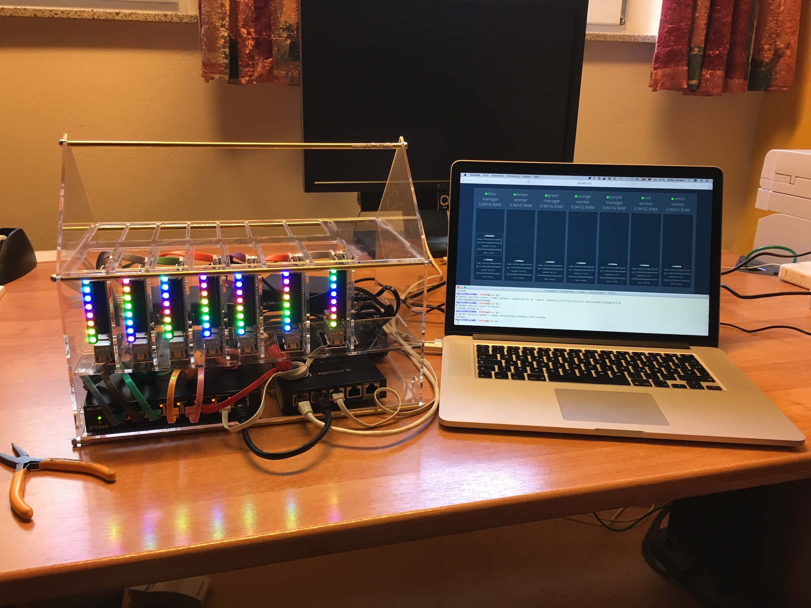
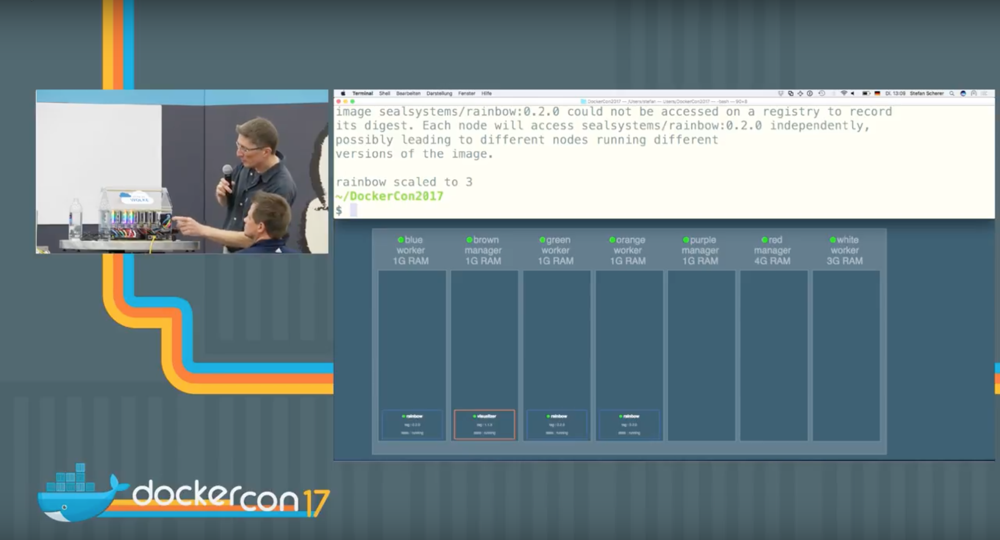
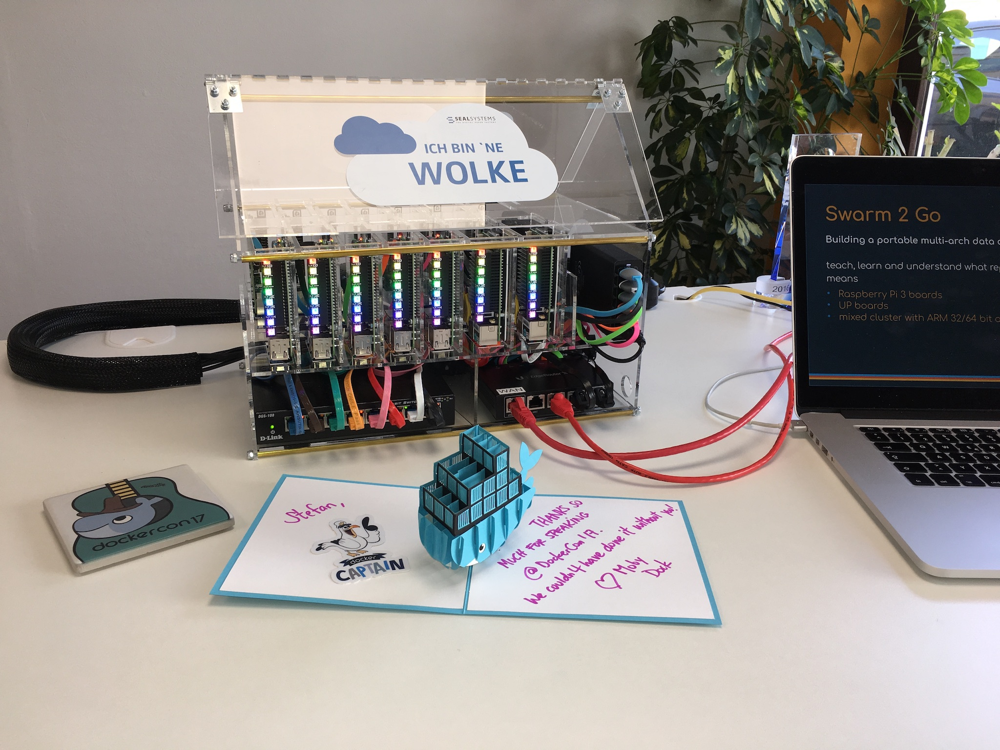

# Tiny Cloud

Build a tiny cloud for demonstration purposes with Raspberry Pi's and UP boards.

Our tiny cloud setup is

- 5x Raspberry Pi 3, ARMv8 64bit CPU, 1GByte RAM, 16 GByte SD card
- 2x UP board, Intel Atom 64bit CPU, 4GByte RAM, 32 GByte eMMC

## DockerCon

I spoke at DockerCon 2017 about our tiny cloud and showed it there.
See sub folder `dockercon` for all scripts used for the live demo.

The video is online on [YouTube](https://www.youtube.com/watch?v=UiJP-368BLA&list=PLkA60AVN3hh_nihZ1mh6cO3n-uMdF7UlV&index=64).

The slides are [online](https://www.slideshare.net/stefscherer/swarm-2-go-build-a-portable-multiarch-data-center-with-pi-and-up-nodes).

## Build your own tiny cloud

You can build and assemble the tiny cloud yourself. There are assembly instructions covering the following parts

  - [Part 1 - Assemble the Housing](housing/README.md#assembling)
  - [Part 2 - Assemble the riser cards](housing/RISERCARDS.md)
  - [Part 3 - Attach Anker USB Power supplies](housing/ANKER.md)
  - [Part 4 - Attach the switches](housing/SWITCHES.md)
  - [Part 5 - Cabling](housing/CABLING.md)
  - [Part 6 - Final assembling](housing/FINAL-ASSEMBLING.md)
  - [Run a swarm demo](dockercon/README.md)
  
  
