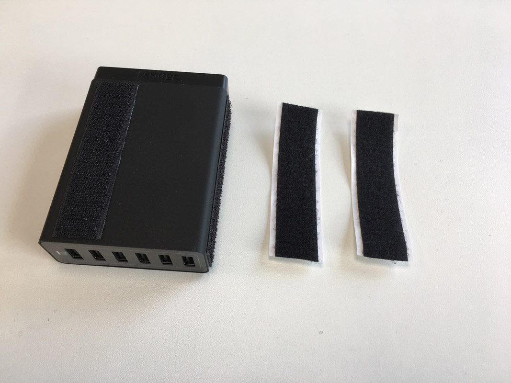
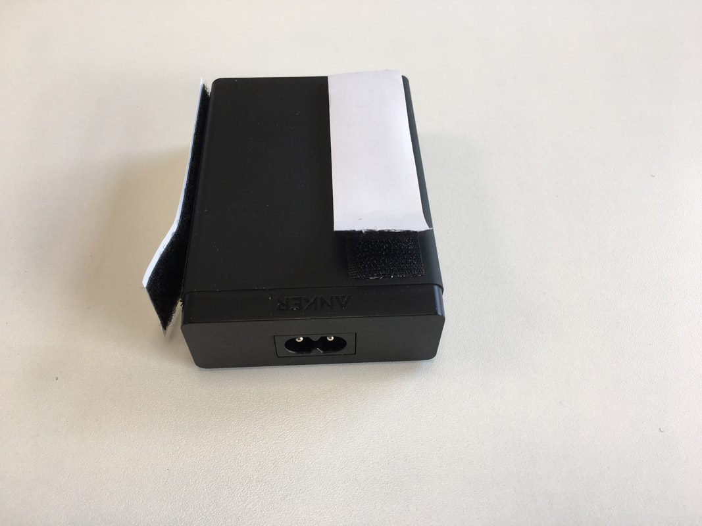
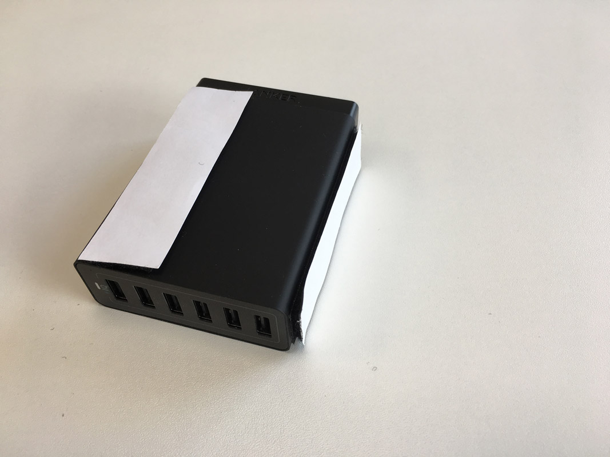
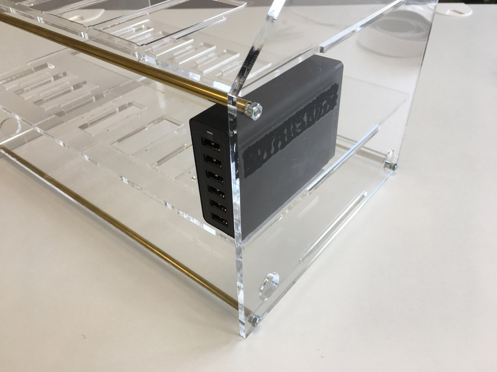
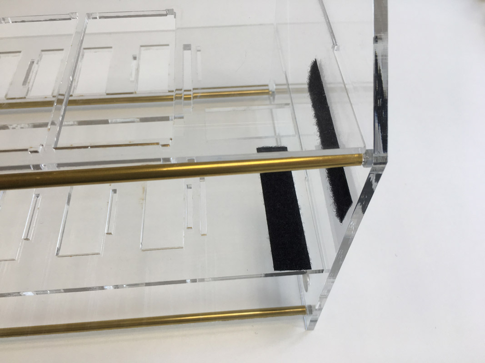
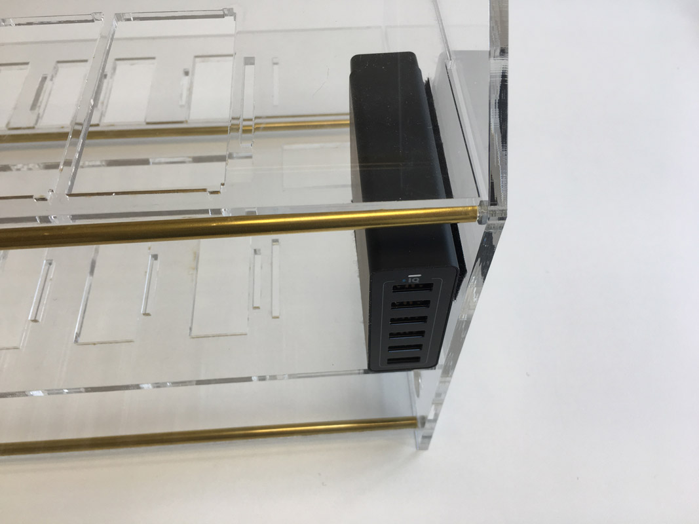
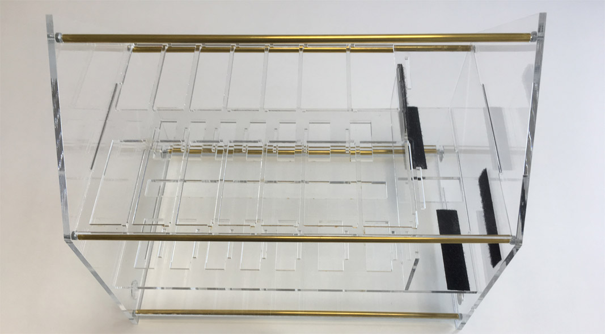

# Part 3 - Assemble Anker USB Power supplies

In [part 3](./RISERCARDS.md) you have assembled the riser cards. Now before we put them into the housing we attach the Anker USB Power supplies and make them stick.

We have used velcro tape to fix the Ankers in the housing. So we can easily disassemble everything again.

Now stick the Anker into the housing.

Remove the Anker once again and fix completely fix the tape at the plates.

Use the same positions of the velcro tape for the second Anker.

In [part 4](./SWITCHES.md) you will assemble the switches into the housing in the same way.
