# Part 5 - Cabling

In [part 4](./SWITCHES.md) we used velcro tape to fix the switches. Now it's time to add the cabling. But you will see very soon that we have to do it in the right order to make it easier to disassemble the whole thing again. I learned this the hard way before my way to DockerCon 2017 as I thought how I should reassemble the PiCloud again in the Hotel in Austin.

## Power cables

First remove all Ankers and switches again.
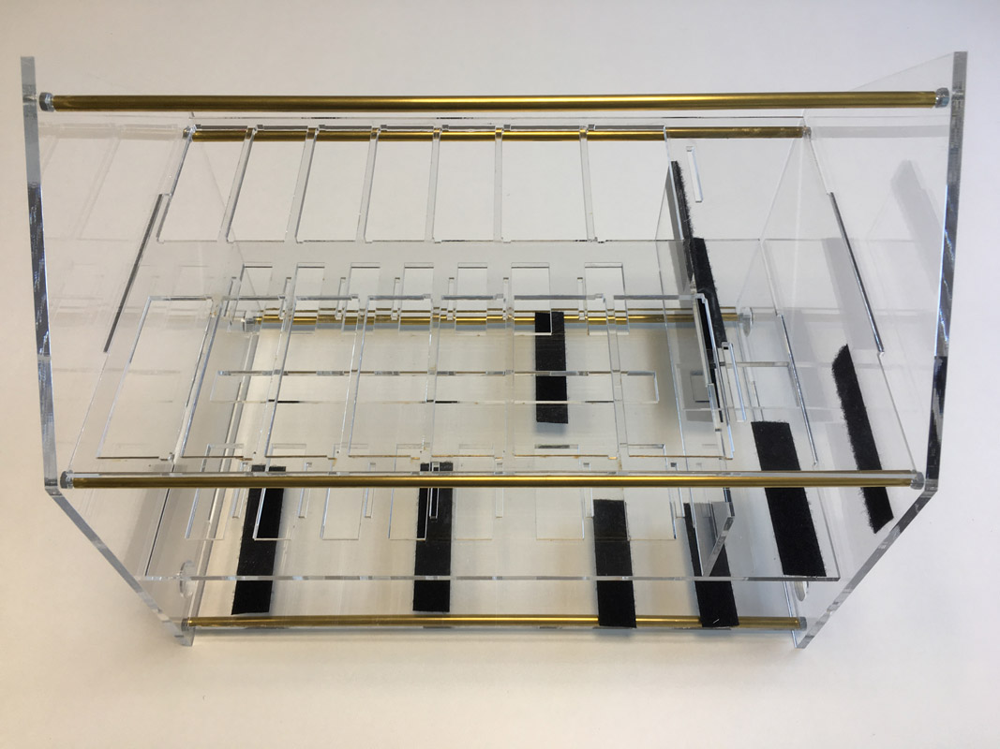

Insert the two power cables for the Ankers and then the four power cables for the UP boards through the left whole in the back.
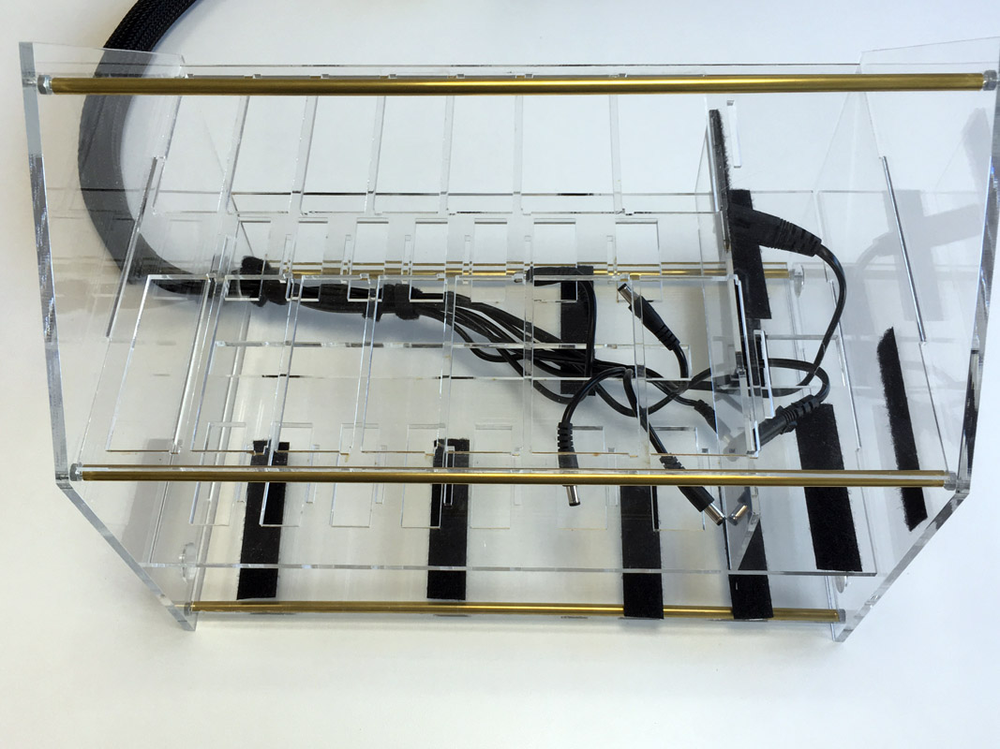

Arrange the cables to fit to their desired places.
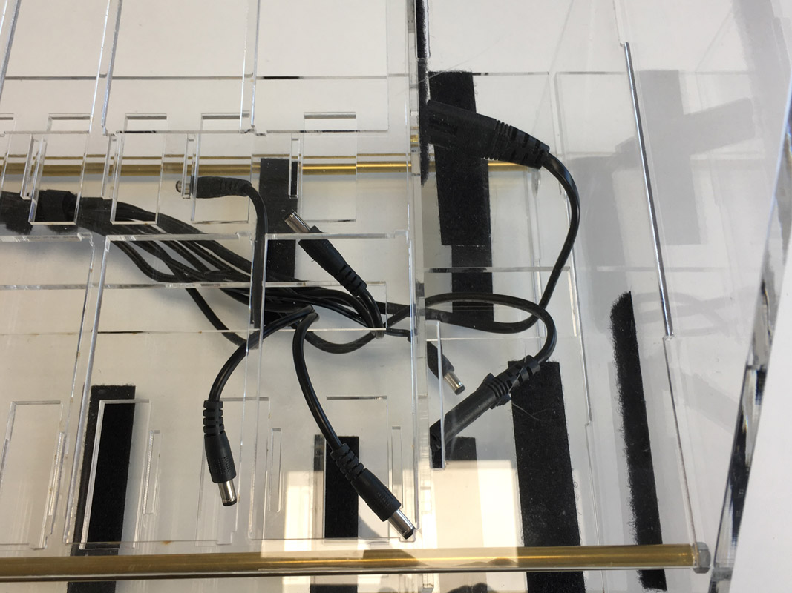

Now use cable ties to fix the cabling. Use an eight port plug strip with a power switch so you can turn on the cloud with just one switch. I also needed only one US adapter to power that at DockerCon 2017 in Austin.
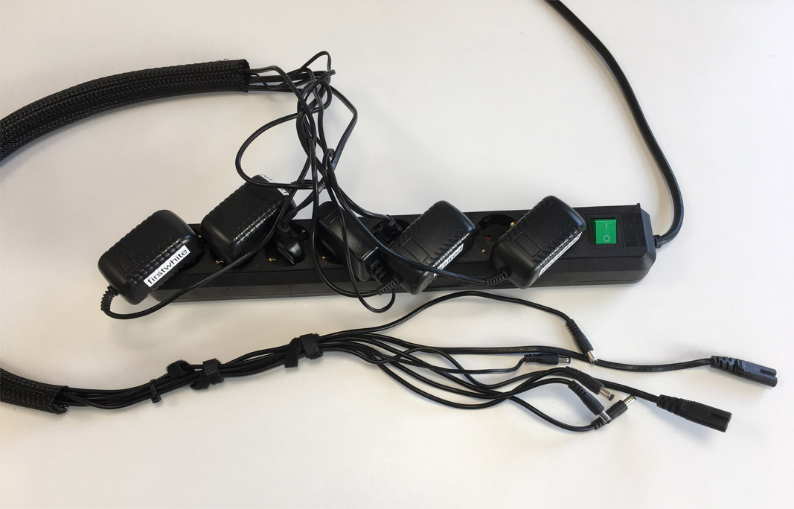

## Patch cables for first switch

It helped me a lot to tie the network cables together. We need seven colored patch cables and one black cable that is longer to reach to the edge router.
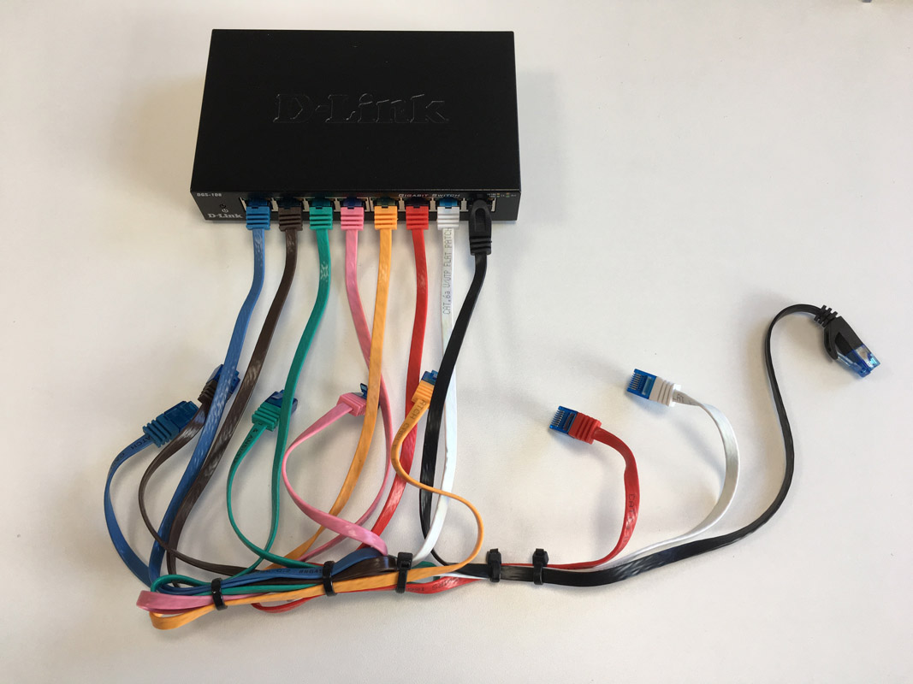
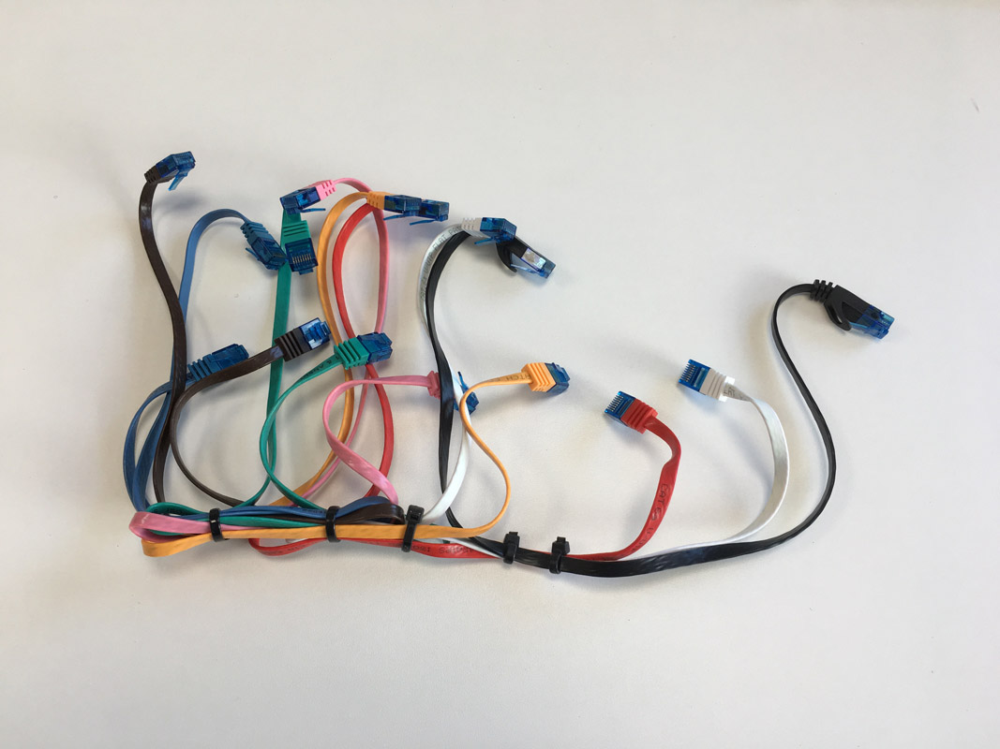
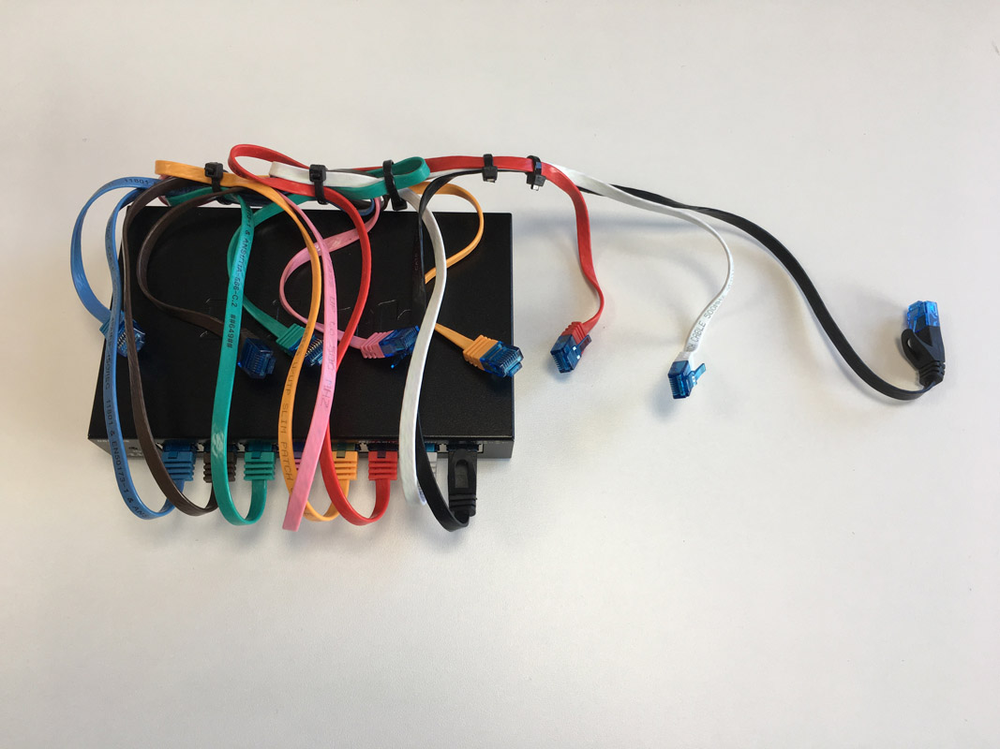

Insert the switch with the network cables and arrange the network cables like this.
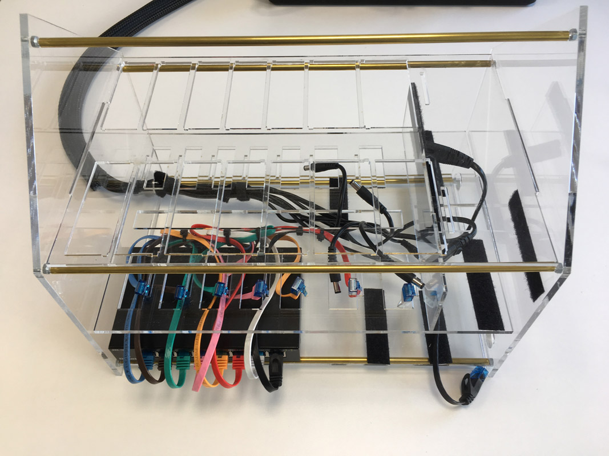

## USB cables for first row

Now pick five colored USB cables for the first row of Raspberry Pis. Also add a USB cable for the first switch. Tie the cables together.
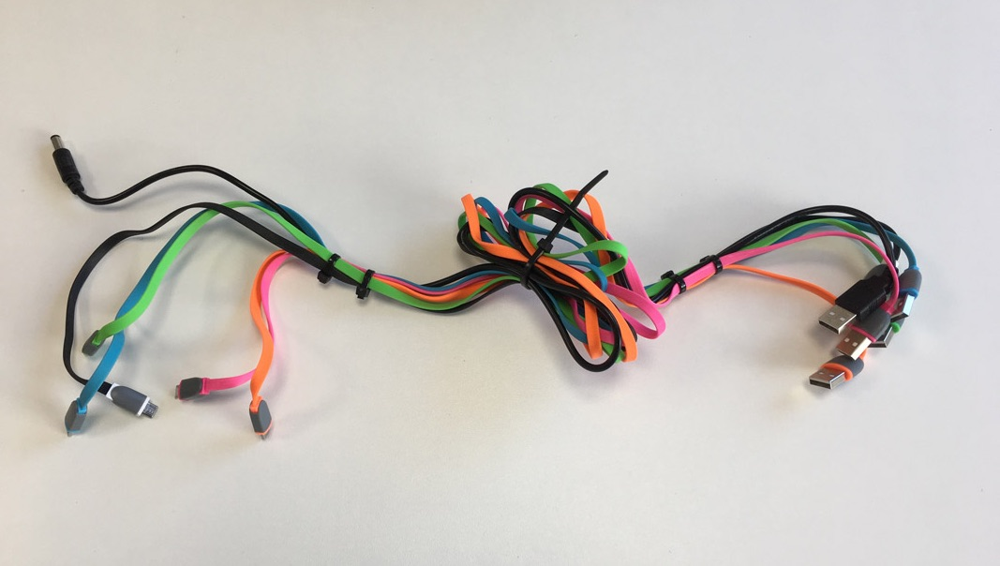

Insert it into the housing and place the cables.
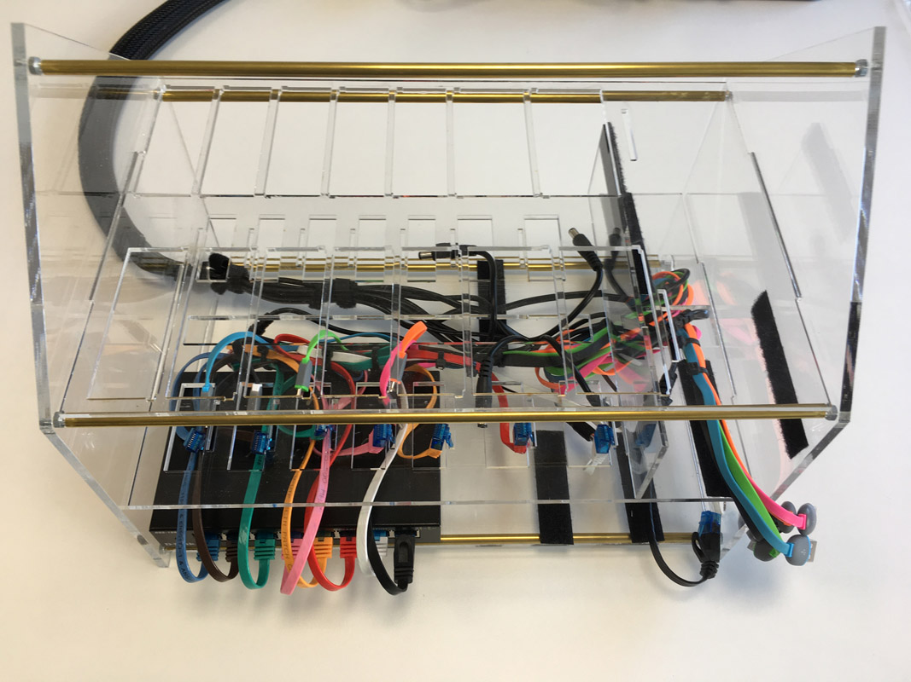

## USB cables for second row

Now pick another five colored USB cables for the second row of Raspberry Pis. Also add a USB cable for the second switch. Tie the cables together.
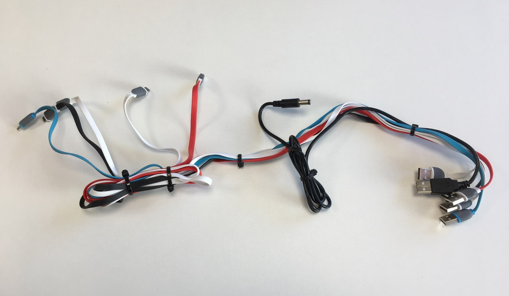
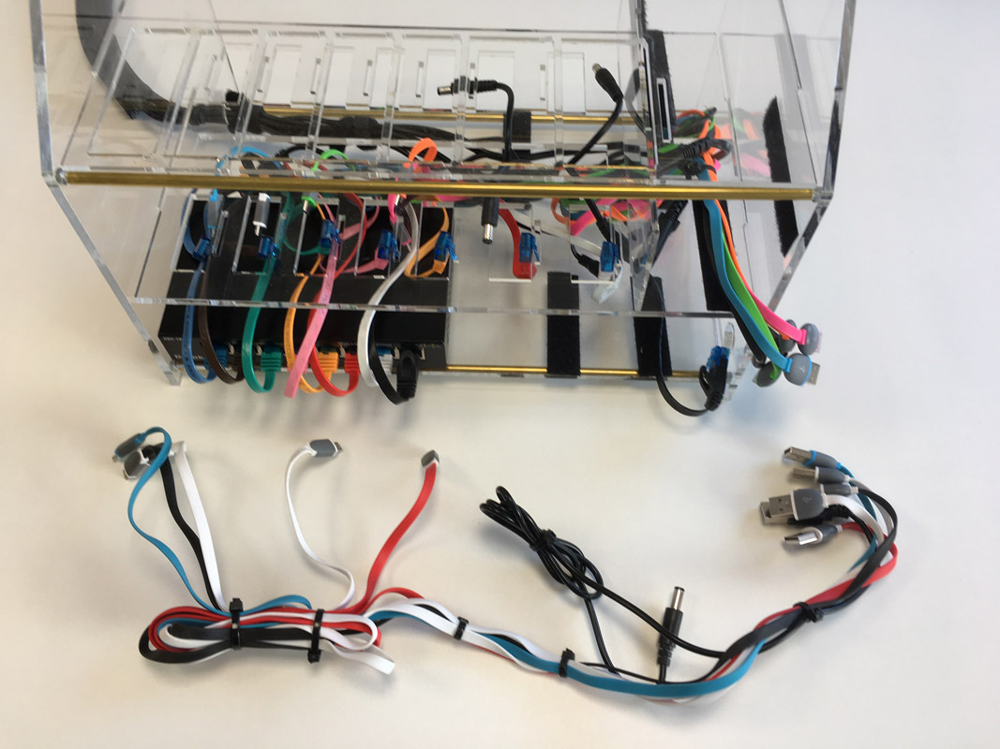

Now it looks a little messy, but these tied cables help a lot reassembling all parts.
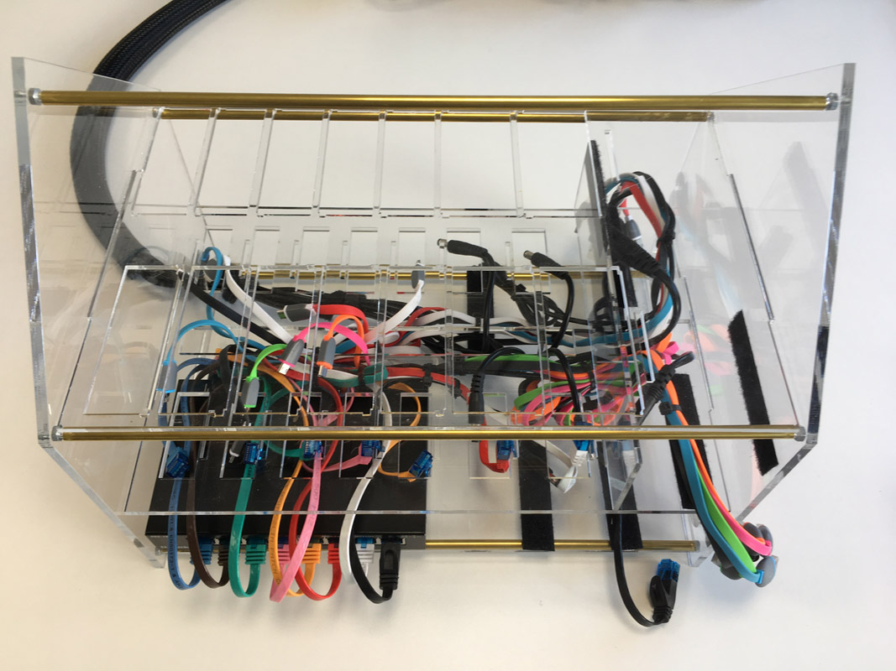
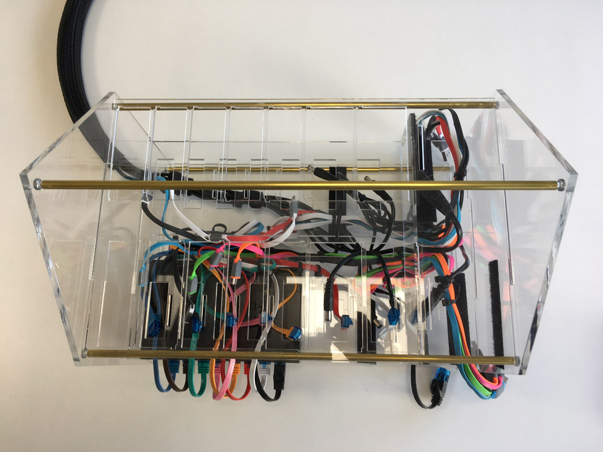

