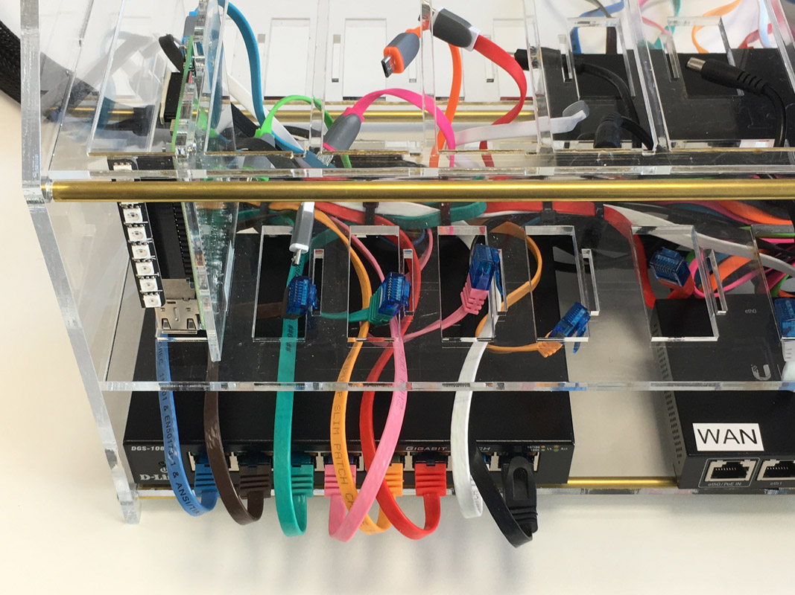
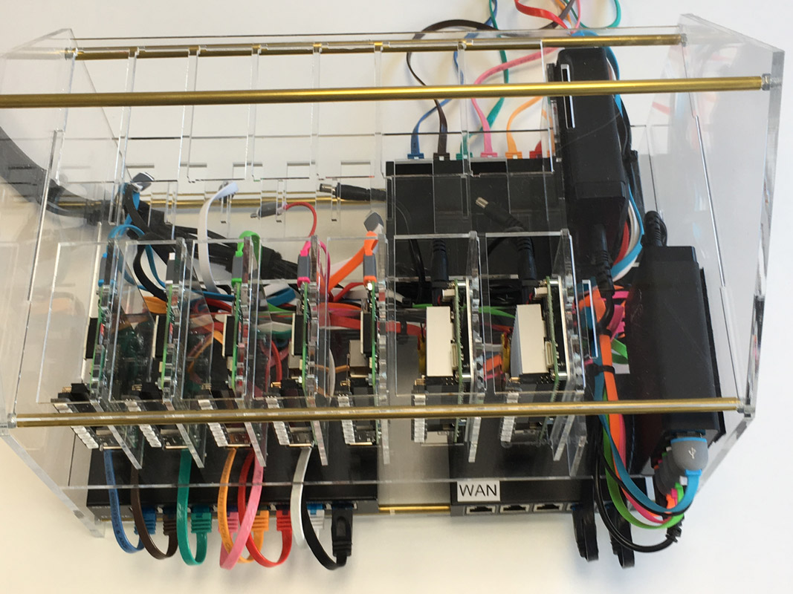
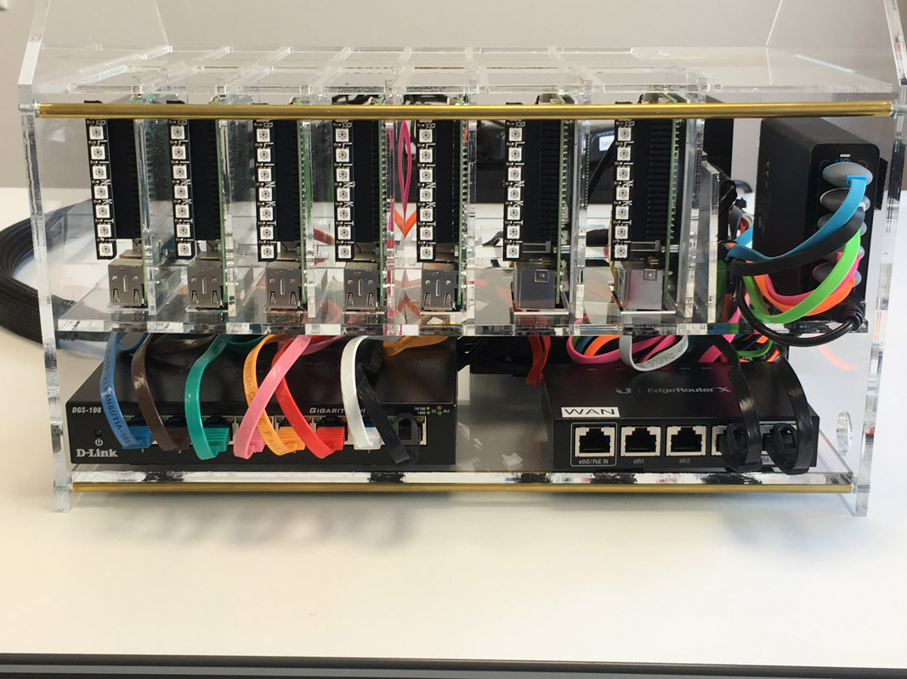
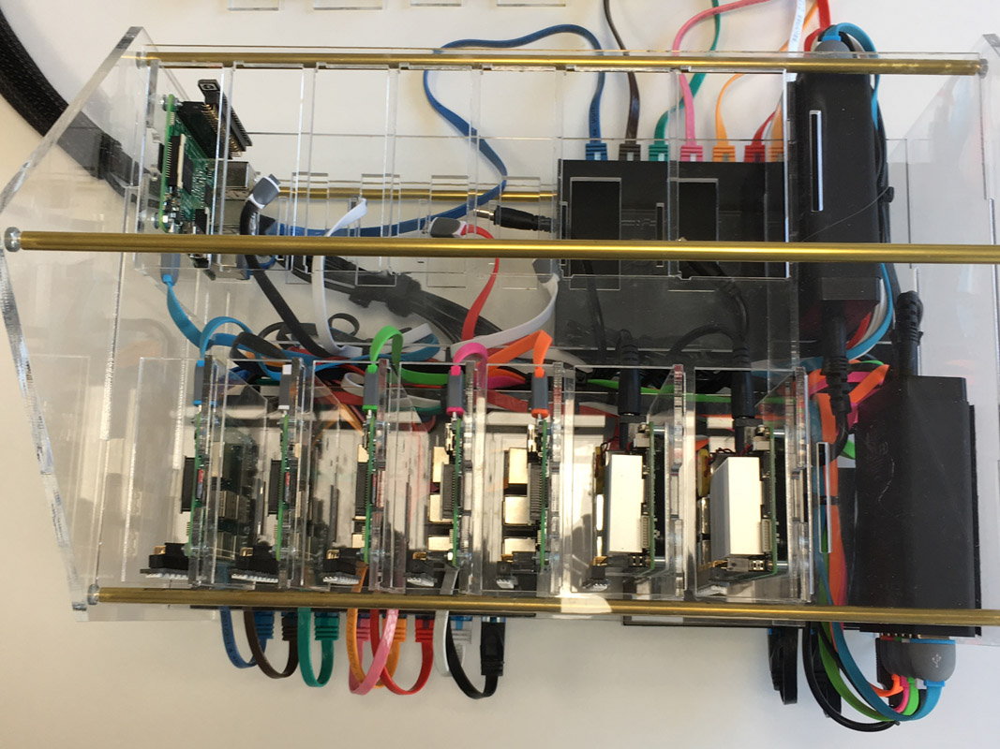
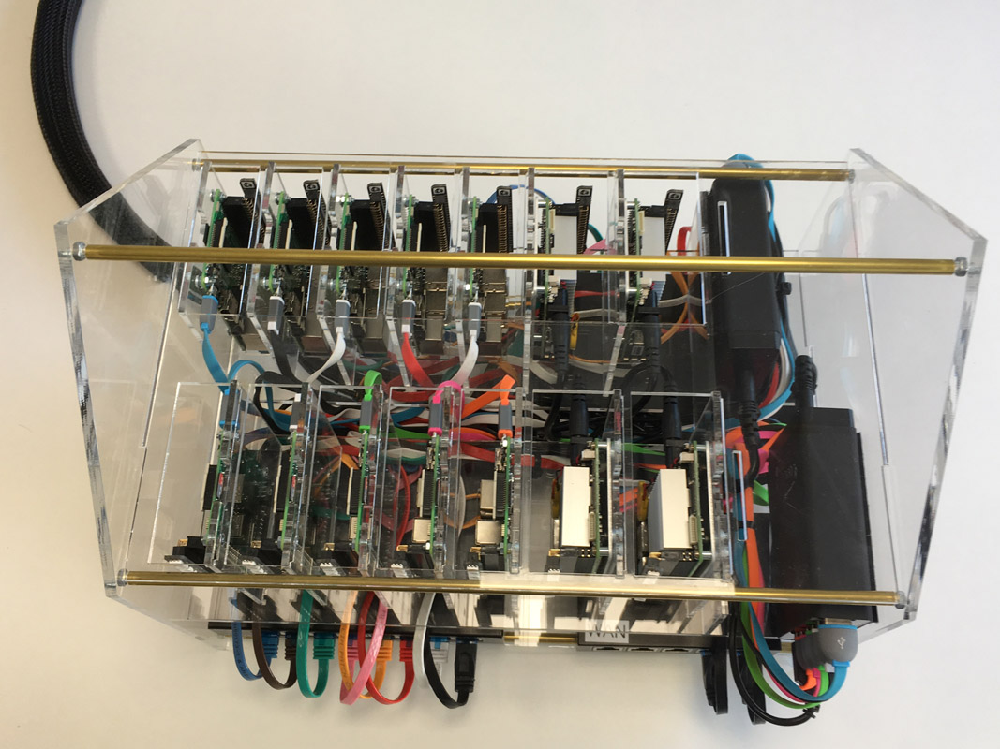
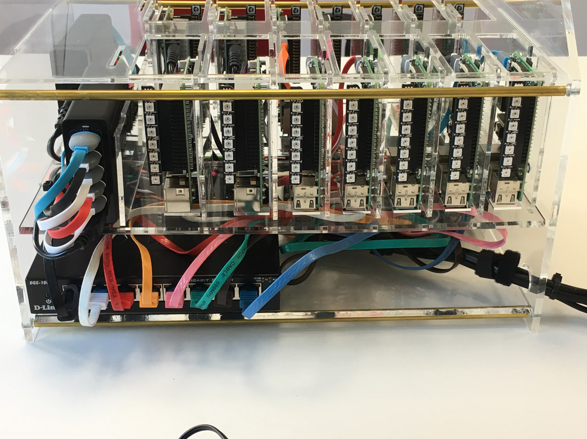
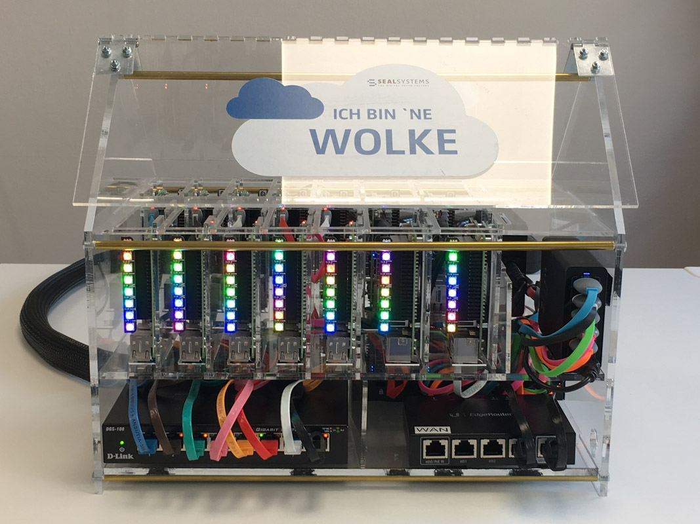

# Part 6 - Final assembling

In [part 5](./CABLING.md) we inserted all the cables into the housing. Now it's time to insert the riser cards and connect power and network cables to each node.

## First row

Start with the first row (the front side with the edge router). Insert the Raspberry Pis and connect the patch cable and USB cable, one riser card after another.

## Second row

Turn around the housing and insert the riser cards of the second row. Also start with the Raspberry Pis and connect the patch cable and the USB cable.

I've put the patch cables of the second row without cable ties as there was no space left to tie them together.

## Operating System

We are finished with the hardware, let's install the operating system on each node.

### Flash SD cards

Flash all SD cards for the Raspberry Pis. Use the detailed steps [Prepare Raspberry Pi 3](../prepare-hardware/pi) how to insert SSH keys and the hostname for each node. After that just insert the SD cards into each Raspberry Pi node.

### Install Ubuntu on UP Boards

I have created an USB stick with Ubuntu to boot the UP Boards. You need a monitor and keyboard to run the installation.
See the detailed steps [Prepare UP Board](../prepare-hardware/up) how to install Ubuntu.

## Turn it on

It's alive!

Have much fun building your own tiny cloud!
