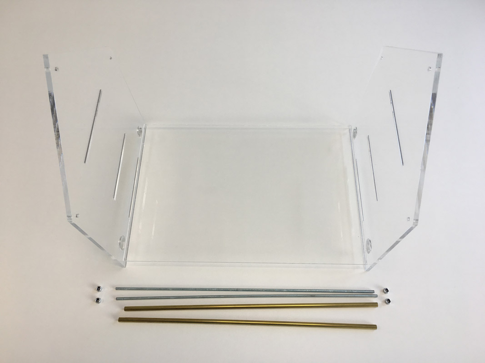
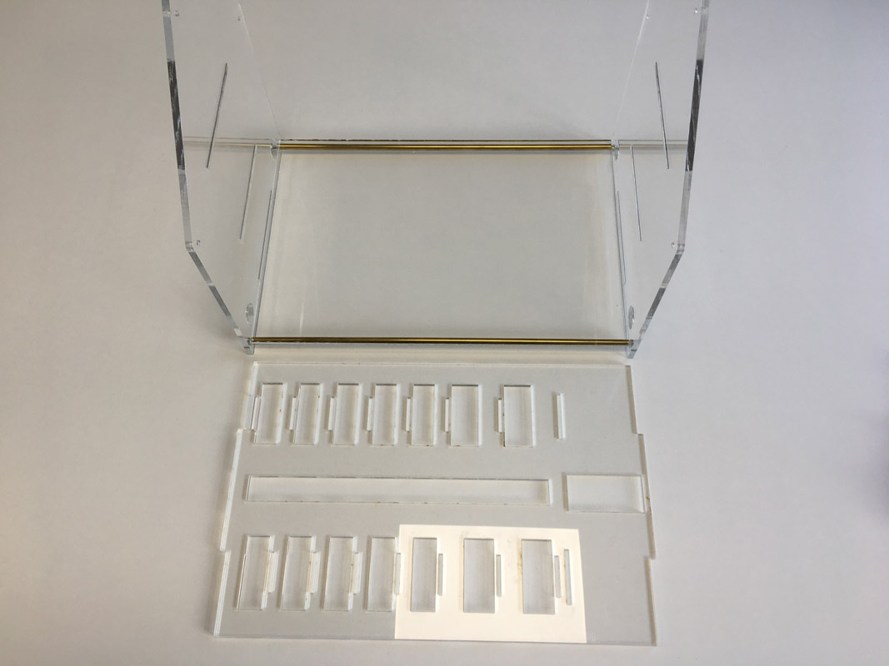
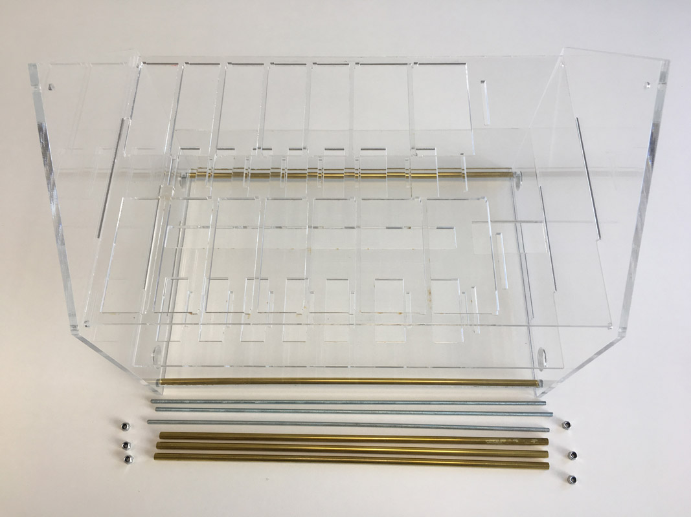
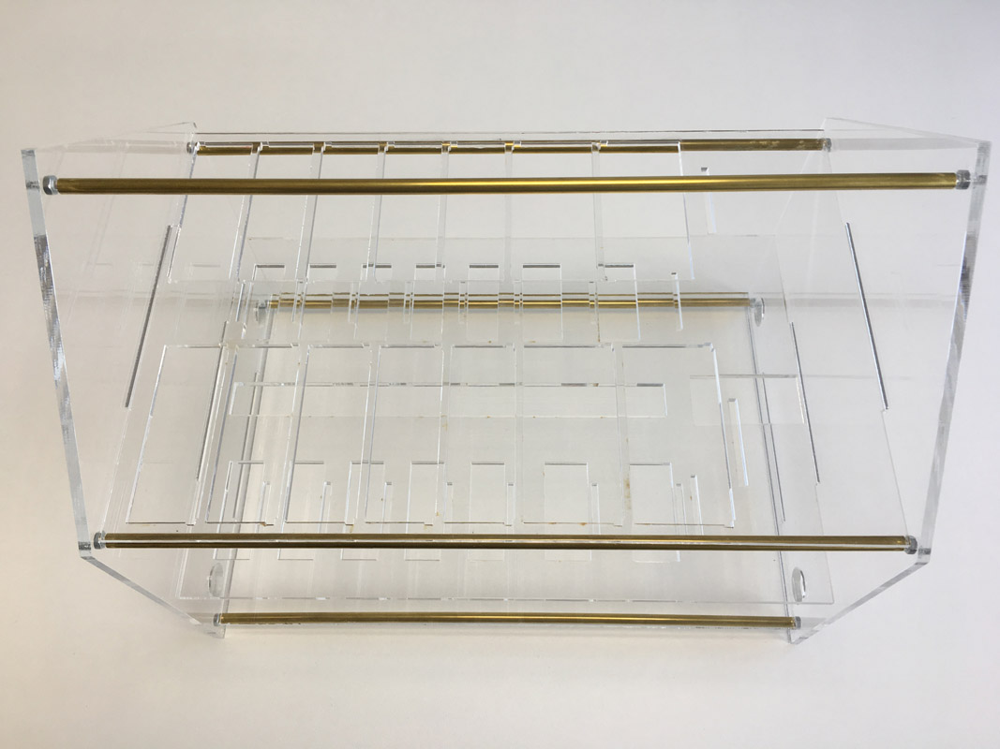

# Tiny Cloud Housing

## Outline
For our tiny cloud to be mobile (and also look more neat), it needs what all
professional cloud data centers have: a housing. In our case: a _tiny_ housing.
The general idea is to not just stack PIs together using spacer tiles, but to
build a modular casing which can be outfitted with one or several cloud nodes
as necessary. And for purposes of a showcase, we think the housing should
actually look like real house.

So the goal is to build a house model which can accomodate up to ten Raspberry
PIs and four UPs, providing space for all necessary connectivity and having
the _Blinkt!_ LEDs face outwards to make the result look nice and geeky when
operated.

## Approach
We decided to build a two-storey building with a ground floor for the network
infrastructure, and a first floor for the cloud nodes - plus a compartment for
power supply. To make the technology quite visible, we wanted the housing to
be transparent; acrylic seemed a good idea. Originally, we went for 3mm material and the design worked well with this; in the current version, we used 5mm
material for the walls, base and layer 1 boards, to make the housing more
robust. If you'd like to go for a different thickness,
you'll need to tweak the design (e.g. grooves and tongues) accordingly.

We designed the necessary parts in _Inkscape_ and saved the design as _Scalable
Vector Graphics (SVG)_ files. Also, since we had access to a _ZING_ laser cutter
with 30 by 40 cm table size, we prepared 30x40cm sheets for producing the parts.
As _ZING_ laser cutters are basically operated by a special printer driver, the
sheets were exported to PDF, ready to cut.
If you have a different laser device, it may be more material-effective to
re-arrange the parts for your material size.

## Making
If you have [FabLab](https://en.wikipedia.org/wiki/Fab_lab) near you that provides a laser cutter, this is
probably the easiest way to get the housing done. However, any other laser cutter
may do as well, or maybe you'd like to try to 3D-print it or use a CNC machine...

If you cut it from 3mm/5mm acrylic, the line width of the design is critical. The
lines need to be _very_ slim (like 0,1 mm or so) in order for the printer driver
to detect them as cut lines. If you make the lines wider, the cutter may ignore
them; if you make them thinner, a PDF export from Inkscape may loose them!
(This is thanks to aggressive optimization in the lib cairo used by Inkscape
to create PDF. Very thin lines are considered to be invisble and therefore
obsolete. Don't ask.)

Note that the lines you need to cut are **red**. We've put the right material
strength into the designs in **blue**. Make sure you don't cut them, too. ZING
laser printer drivers allow you to define which colors to use for cutting,
engraving, and which ones to ignore.

## Assembling
The design is pretty much plug and play. You'll need six lengths of 3mm threaded
rod (studding) and fitting nuts to keep everything together. If you like, you
can also use superglue to fix the edges permanently. You'll need a handfull of
small 2,5mm screws to attach the PI/UP boards to the riser cards. And that's
pretty much all.

We've assembled and disassembled the housing several times when bringing
the tiny cloud to conferences, and that worked well for us.

### Part 1 - Assemble the Housing

To put the housing together start with the ground plate and the both sides. Use two threaded rods and screw the three parts together.

Add the next plate, check the correct orientation.

Add the top plate, also check the correct orientation and use the remaining three threaded rods and screw everything together.

Now you have build the housing.

Now go ahead to [part 2](./RISERCARDS.md) and assemble the riser cards.

**Have Fun!**
