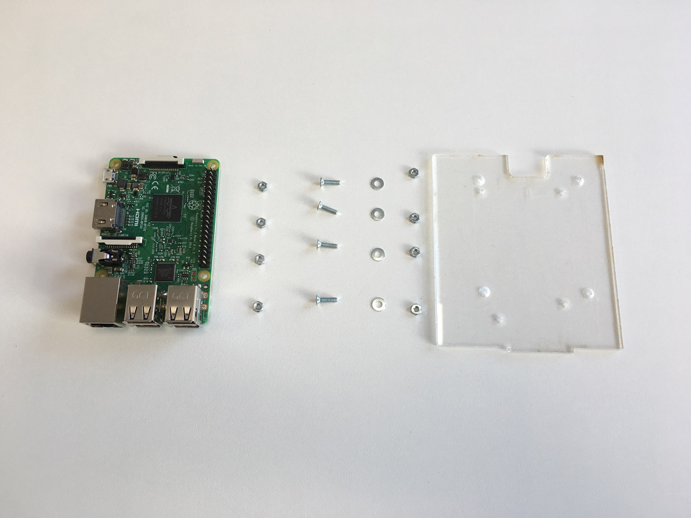
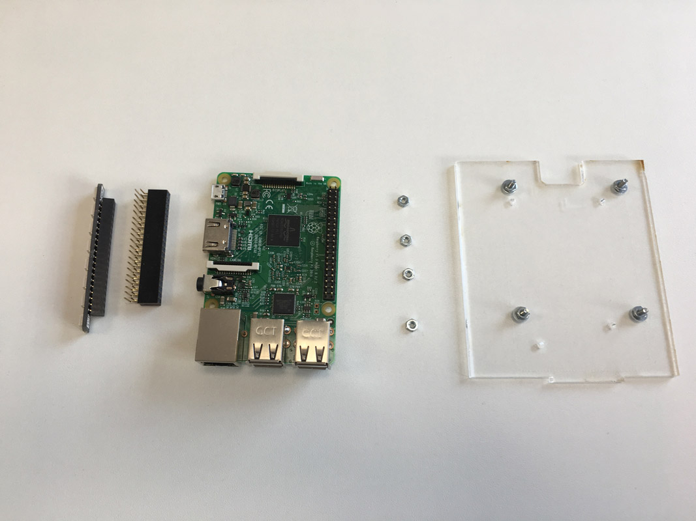
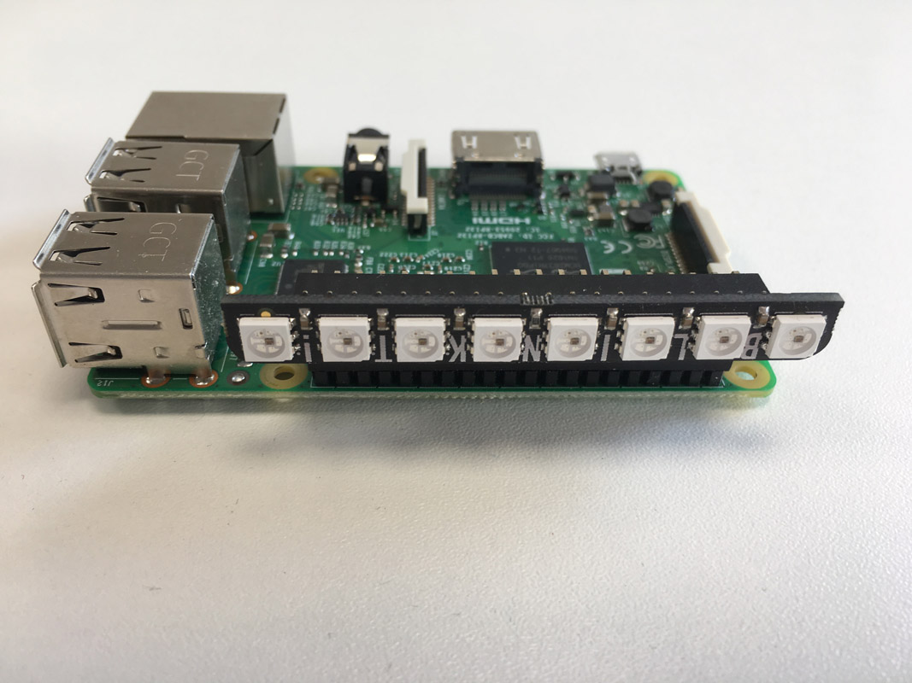
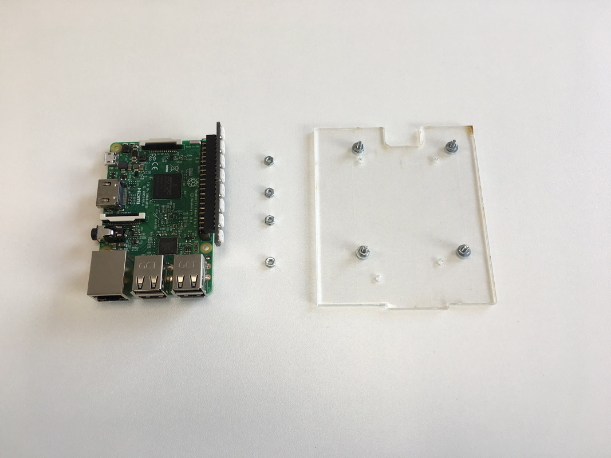
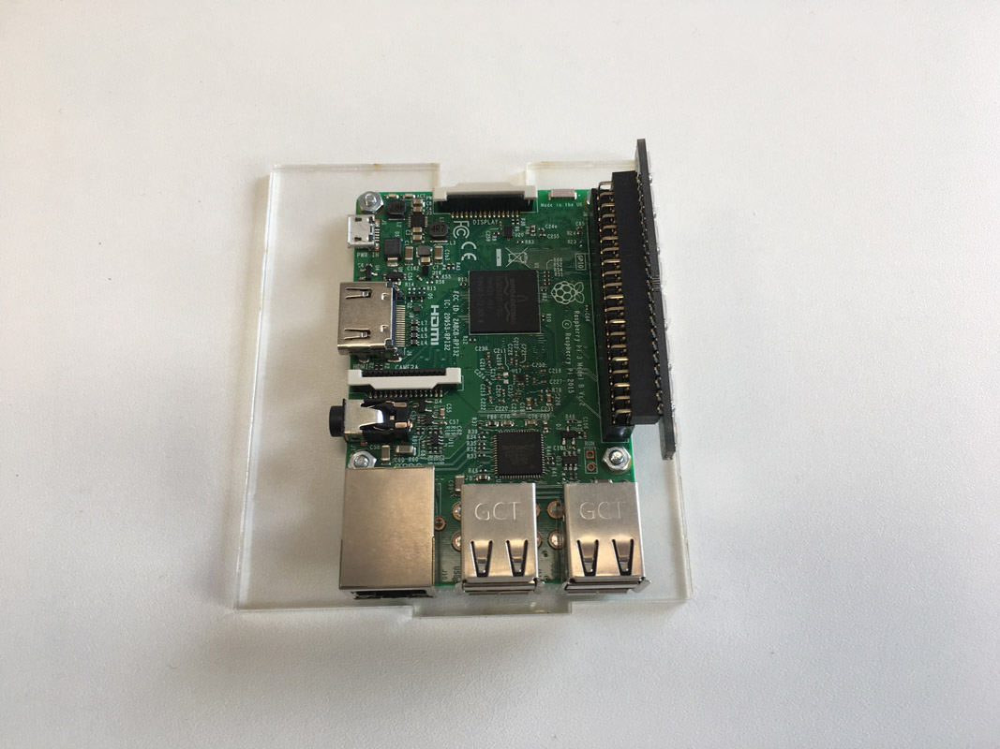
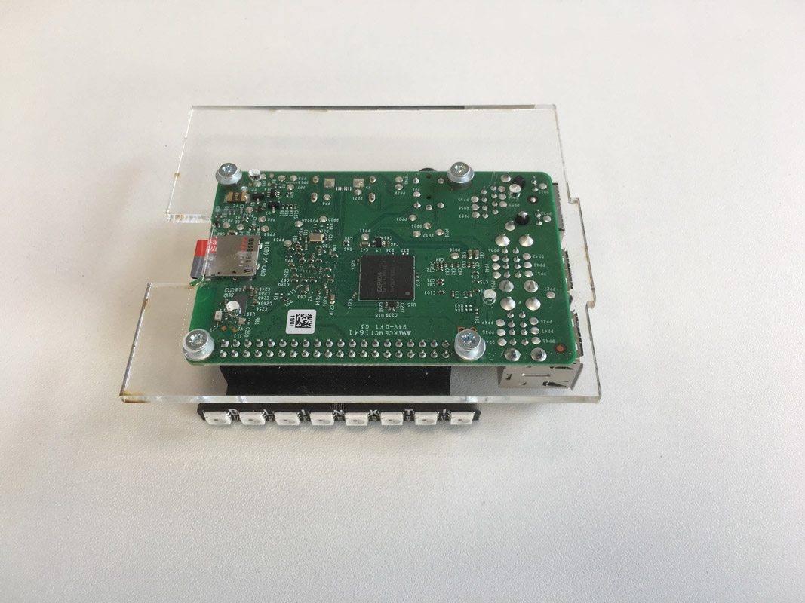
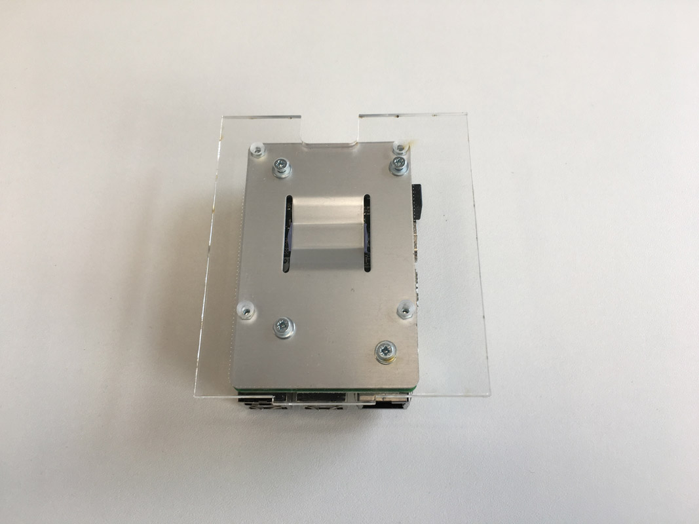
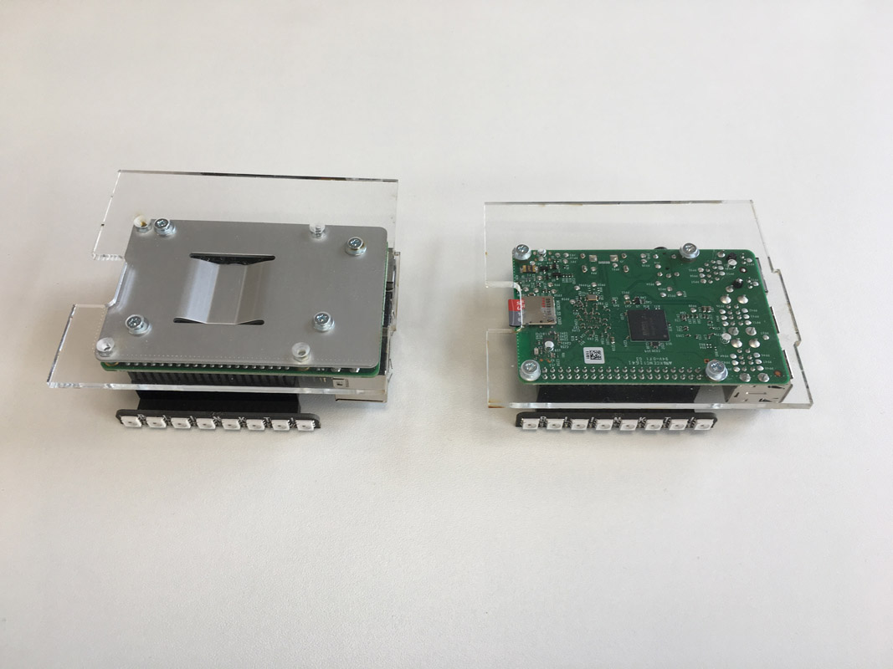
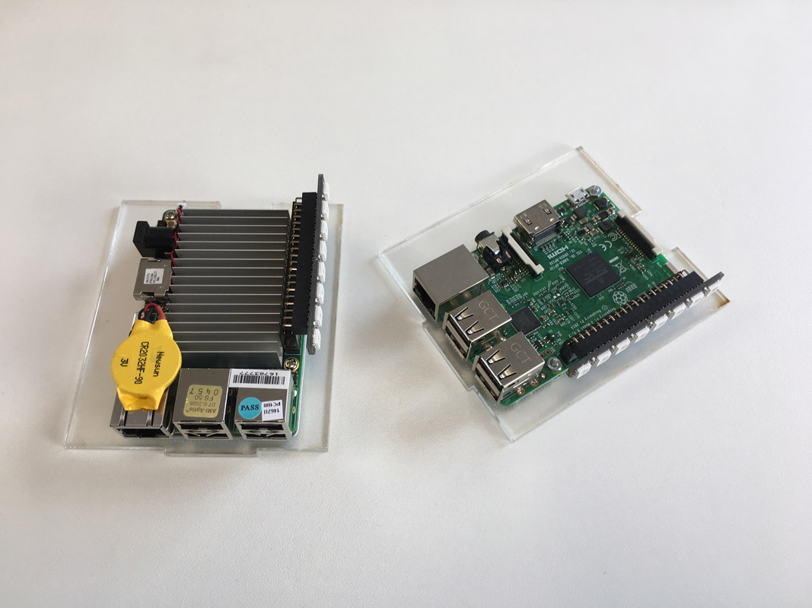

# Part 2 - Assembling the riser cards

In [part 1](./README.md#assembling) you have assembled to housing. Now you build all the riser cards.

## Raspberry Pi

Pick the following parts to assemble the Raspberry Pi to a riser card.

We need four 2.5 mm screws, four washer and four nuts to assemble the screws to the riser card.

### Blinkt

Put together the Blinkt. Check the orientation.

Assemble the Blinkt to the Raspberry Pi. Check the orientation.

## UP Board

Assemble the UP Board to the riser card.

Now you should have assembled your ten Raspberry Pis and four UP Boards.

In [part 3](./ANKER.md) you will attach the two Anker USB Power supplies.
