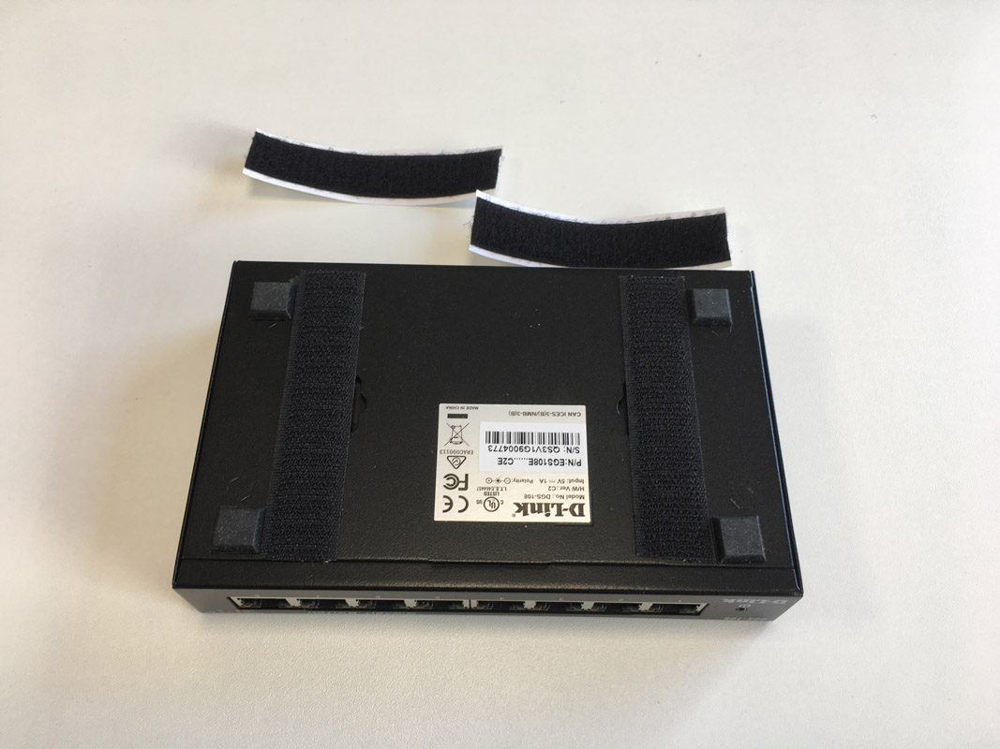
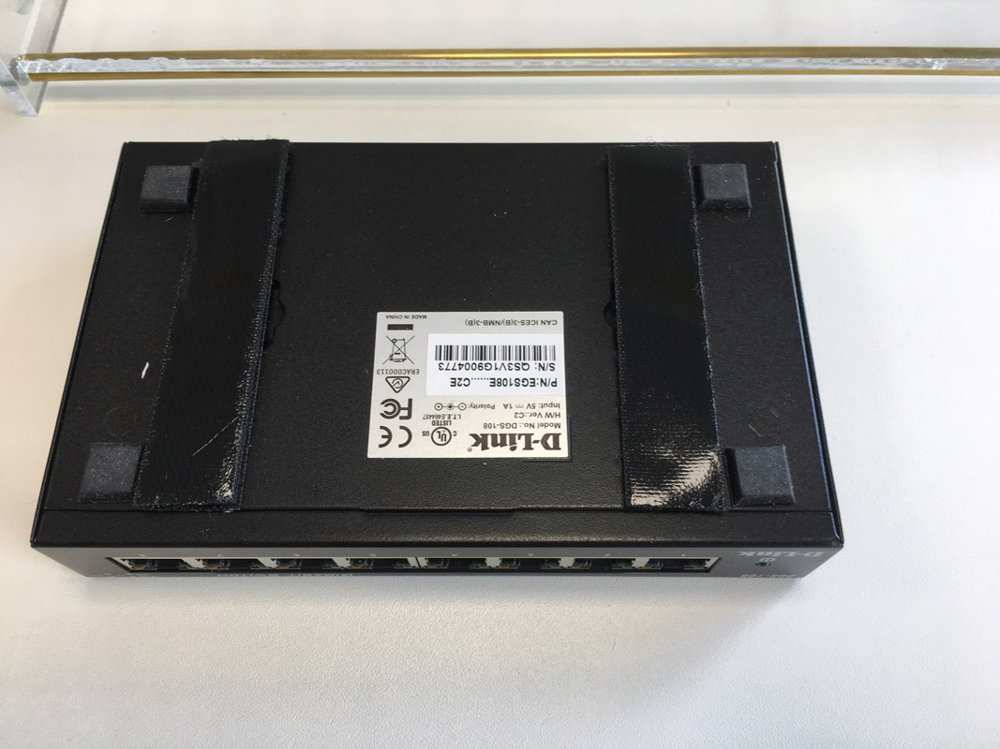
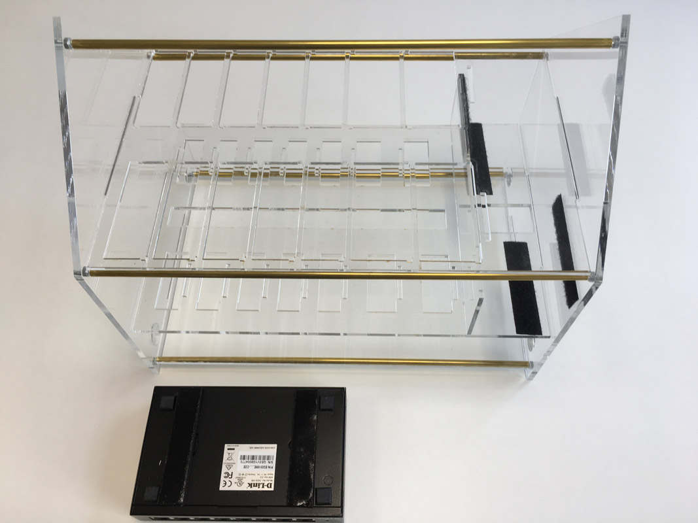
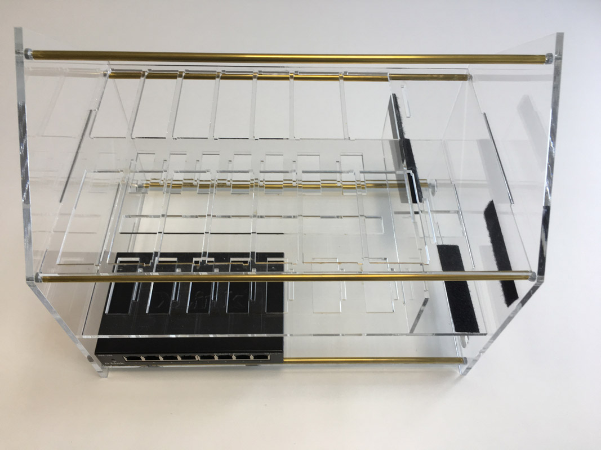
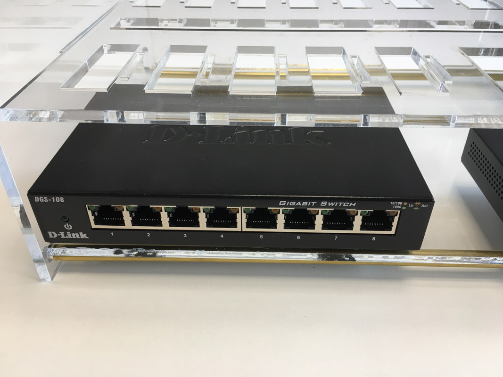
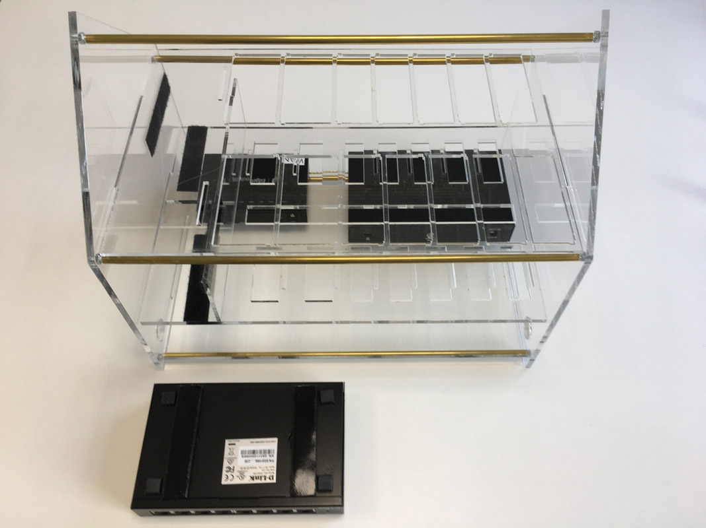
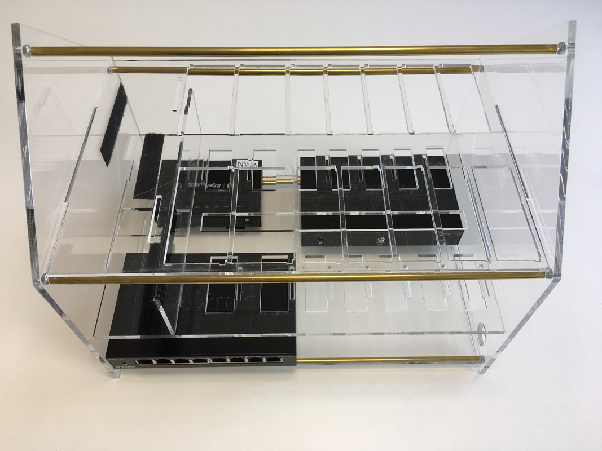
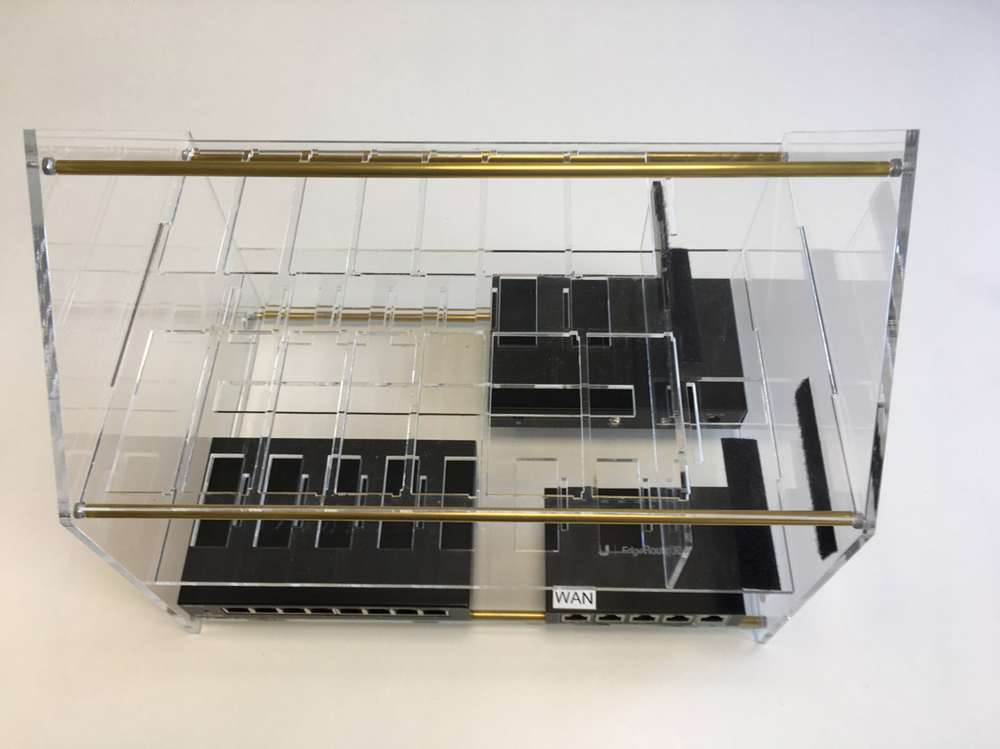
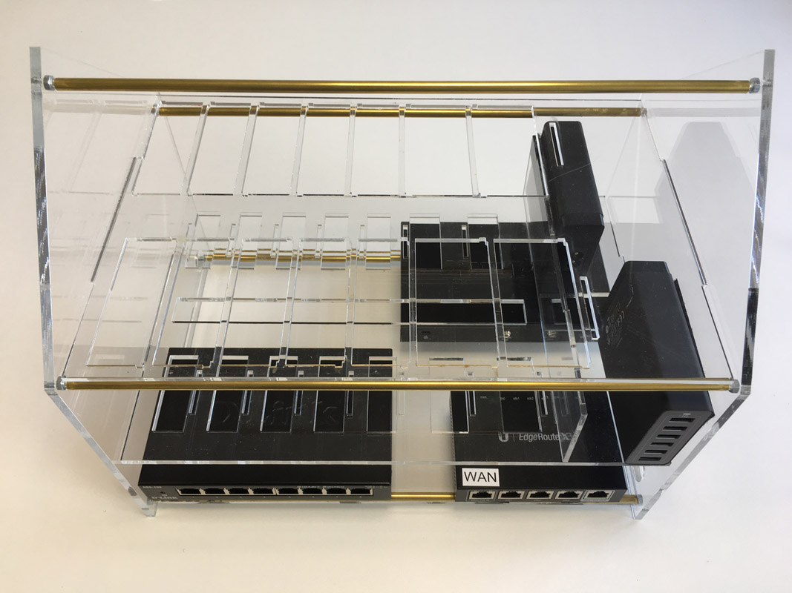

# Part 4 - Assembling the switches

In [part 3](./ANKER.md) you have used velcro tape to assemble the Anker power supplies into the housing. Now we will do the same for the three switches

* Two D-Link 8 port switches
* One Ubiquity Edge Router X

## D-Link Switch 1

Put two strips of velcro tape to the D-Link switch.

Remove the cover.

Place the switch at the left edge and fix it in the housing.

## Edge Router X

Put two strips of velcro tape to the Edge router.

Place the edge router about 2 cm away from the right edge.

## D-Link Switch 2

Turn around the housing to assemble the second switch.
Put two strips of velcro tape on the second D-Link switch.

Place the switch at the left edge.

Turn the housing again.

With the Anker assembled your housing should look like this.

