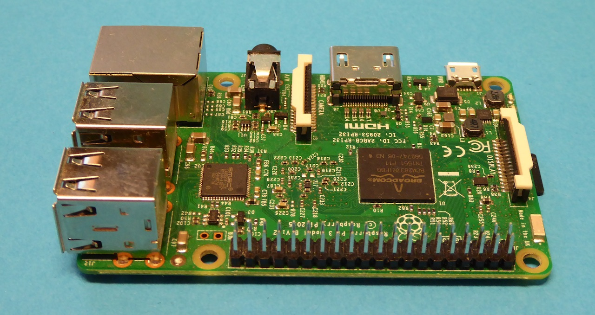

# Prepare hardware

## Raspberry Pi

Flash a prepared Raspbian with Docker and cloud-init and adjust the `user-data` file
before first boot. After turning on the Raspberry Pi your node is up and running.

You can choose one of these operating systems to run Docker on it:

- Raspbian, Linux, ARM 32bit
- HypriotOS, Linux, ARM 32bit
- HypriotOS, Linux, ARM 64bit

## UP Board

Prepare a bootable USB stick with Ubuntu and the preseed files. Adjust the
preseed files to set hostname and SSH keys. After turning on the UP board it
will take about half an hour to have the internal eMMC card installed with
Ubuntu and Docker.

You can choose one of these operating systems to run Docker on it:

- Ubuntu Linux, Intel 64bit
- Windows Server 2016 Core, Intel 64bit
- Windows 10, Intel 64bit (with Hyper-V + Hyper-V containers only)
